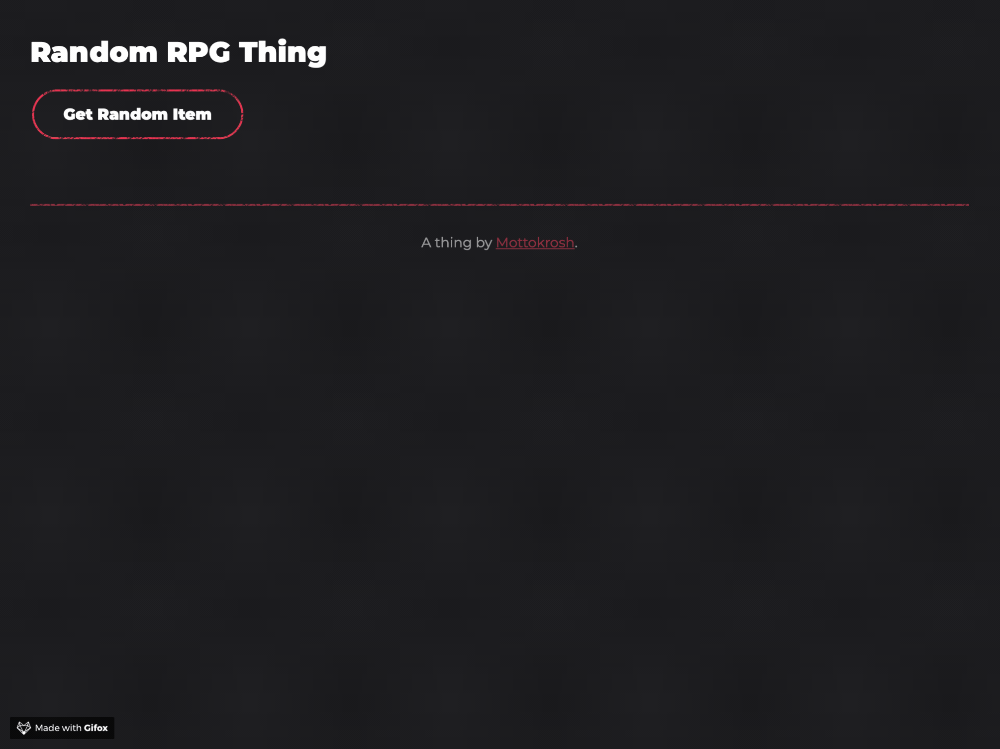

# Random RPG Thing

[](https://app.netlify.com/sites/random-rpg-thing/deploys)

Small app to return a random RPG thing.



## How it works

A static page in `public/` backed by two Netlify Functions that read from a
[Craft](https://www.craft.do) collection via the Craft Multi-Document API.

| Function | Route | Returns |
| --- | --- | --- |
| `functions/all-items.mjs` | `/api/items` | every item |
| `functions/random-item.mjs` | `/api/items/random` | one random item |

Each function declares its route via `export const config = { path }`. Note that
declaring a custom `path` *replaces* the default `/.netlify/functions/<name>`
route rather than adding to it, so those legacy URLs no longer resolve.

Shared fetching, mapping and error handling live in `functions/lib/craft.mjs`.
Items are cached in memory for 5 minutes per warm container, and `/api/items`
is additionally cached at the CDN for 5 minutes.

Each item is returned as:

```json
{
  "id": "…",
  "Name": "Single Gauntlet",
  "Description": "A single gauntlet, still clutching a golden necklace…",
  "Source": "Brutal Imperilment in the Bag of Infinite Holding",
  "Source SKU": "MM0002"
}
```

## Configuration

Set these environment variables on the Netlify site:

| Variable | Description |
| --- | --- |
| `CRAFT_API_URL` | Base URL of the Craft connection, e.g. `https://connect.craft.do/links/<linkId>/api/v1` |
| `CRAFT_COLLECTION_ID` | ID of the Items collection (`GET /collections` lists them) |

The link ID in `CRAFT_API_URL` grants read *and write* access to the connected
documents, so treat it as a secret and keep it out of the repo.

## Local development

```
npx netlify dev
```

No dependencies to install — the functions are Netlify Functions v2 (ESM) and
use built-in `fetch`.
